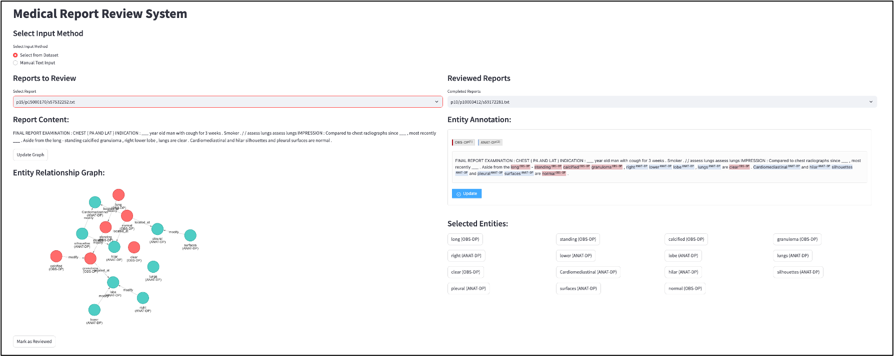
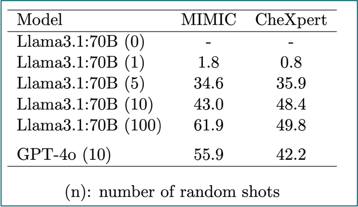

# Biomedical and Medical Knowledge Graph Construction - Named Entity Recognition & Normalization and Relation Extraction 
## Badges
[](https://github.com/MouYongli/MedKGC)
[](https://huggingface.co/spaces/hanbinChen/medKGC)
[](https://opensource.org/licenses/MIT)


Access our online demo deployed on Hugging Face Spaces:  
[MedKGC Demo](https://huggingface.co/spaces/username/medkgc-demo)



## Project Story
This project focuses on Named Entity Recognition, Relation Extraction, and Named Entity Normalization in radiology, with the final output presented in the form of a knowledge graph.

The project implements these functionalities and provides methods for evaluation.

## Project Structure
The project is organized as follows:
```
MedKGC/
├── data/                   # Directory for storing datasets
│   ├── radgraph/          # RadGraph dataset and related files
│   └── radlex/            # RadLex terminology files
├── docs/                   # Project documentation
│   ├── index.html         # Documentation homepage
│   ├── ...               # Other documentation pages
│   └── assets/            # Static assets for documentation
├── notebooks/              # Jupyter notebooks for experiments and analysis
├── src/                    # Source code for the project
│   └── medkgc/             # Main package for the project
│       ├── ie/             # Information extraction related code
│       │   ├── pipeline/   # Pipeline for NER, normalization, and relation extraction
│       │   │   ├── ner/    # Named Entity Recognition
│       │   │   ├── re/     # Relation Extraction
│       │   │   └── nen/    # Named Entity Normalization
│       │   └── utils/      # Utility functions and scripts
│       └── nen/            # Named Entity Normalization specific code
│           ├── resource/   # Resources for normalization
│           └── notebooks/  # NEN analysis notebooks
├── tests/                  # Unit tests for the project
├── requirements.txt        # Python dependencies
├── setup.py                # Package installation configuration
└── README.md               # Project documentation
```

## Dataset Setup

Existing Dictionaries
- UMLS: Snomed CT, MeSH

## Python Environment Setup

1. conda environment
```
conda create --name=medkgc python=3.10
conda activate medkgc
pip install -r requirements.txt
```

2. environment variables
Set the home directory for Hugging Face:
```
export HF_HOME=~/Data/huggingface
```
3. project environment parameters

Set project environment parameters in the [.env](.env) file.

## Usage
Shell scripts are provided for direct execution.  
For example, ner.sh:
```
./ner.sh
```
You can set parameters and run directly; the program will make predictions, evaluate, and output results.  

## Run Tests
Run tests:
```
pytest ie/utils/test_ner.py -v
```
<details>
<summary>Detailed Information</summary>
`-v` - verbose mode, display detailed test output information
</details>

## Technology Stack
The project utilizes the following key technologies and tools:

- **Hugging Face Transformers**: Pre-trained models for NER and relation extraction
- **API calls**: Integration with UMLS API for entity normalization
- **Streamlit & Gradio**: For building interactive demonstration interfaces
- **Data processing**: Custom data cleaning and formatting pipeline
- **Hugging Face Dataset**: Project datasets published on the Hugging Face platform
- **Hugging Face Spaces**: Project demo deployed on Hugging Face Spaces
- **RAG with UMLS**: Combining retrieval-augmented generation with UMLS medical terminology

## Some Concepts
**mention / token**: a span of text in a report, which may or may not refer to an entity  
**entity**: result of NER, also a span of text in a report, which is recognized as a named entity  
**term**: a concept or standard form in a dictionary (e.g., UMLS).  

## Methods

This project implements a complete medical knowledge extraction pipeline:

1. **End-to-end Medical Knowledge Extraction Process**
   - Utilizing large language models and **Hugging Face** libraries to extract medical knowledge from radiology reports
   - Building a complete processing pipeline, from raw text to structured knowledge graphs
   
2. **Named Entity Recognition Implementation**
   - Using **GPT-4o and Llama3** for high-precision medical entity recognition
   - Adopting innovative **RAG methods** to integrate UMLS medical terminology knowledge
   - Implementing a combination of traditional methods and large model approaches, significantly improving performance

3. **Knowledge Integration and Normalization**
   - Aligning identified entities with medical standard terminology
   - Building structured medical knowledge graphs to support clinical applications

## Output
- Human annotated data as golden data, [dataset](nen/humanReview/reviewed.xlsx)
- Processed dataset published on [Hugging Face Datasets](https://huggingface.co/datasets/WestAI-SC/RadLink) 

## Experimental Results

### NER Task Results
I conducted experiments with Llama and GPT-4o on the NER task, and obtained a series of experimental results through entity-level evaluation:



The above figure shows the performance comparison of different models on the entity recognition task, including precision, recall, F1 score and other metrics.

### Few-shot Prompting Experiments

We conducted **few-shot prompting** experiments to evaluate the performance of large language models on radiological texts:

- Tested the impact of different numbers of examples on model performance
- Compared the effects of different prompting strategies
- Analyzed the models' understanding capacity of professional terminology in the medical domain

These experimental results provide important insights for model selection and prompt engineering in clinical environments, especially when dealing with professional medical content such as radiological texts.

## Conclusions & Contributions

This project makes the following significant contributions to medical natural language processing and knowledge graph construction:

* **Comprehensive Evaluation** - Conducted a comparative assessment of specialized biomedical and general-purpose LLMs for radiological text processing, establishing performance benchmarks under various conditions
  
* **Enhanced Evaluation Framework** - Developed improved evaluation frameworks for assessing radiological NER and NEN performance, providing more nuanced performance metrics than traditional approaches
  
* **Annotated Corpus** - Created a manually annotated corpus of 1,250 entities mapped to standardized UMLS concepts, addressing a critical gap in available resources for this domain
  
* **Innovative RAG Architecture** - Implemented a novel retrieval-augmented generation architecture that effectively combines LLMs with established medical ontologies, showing significant performance improvements over traditional approaches
  
* **Practical Deployment Guidelines** - Provided insights into optimal model selection and configuration across varied data availability scenarios, offering practical guidance for clinical deployment of these technologies
