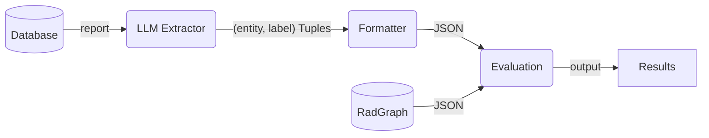

# Named Entity Recognition for Medical Reports

## Overview
This project aims to extract named entities from radiology reports using Large Language Models (LLMs) and compare their performance against the RadGraph dataset ground truth. The system focuses on identifying anatomical structures and medical observations with their presence status.

## Project Structure
```
MedKGC/
├── data/
│   └── radgraph/                  # RadGraph dataset
├── src/
│   └── medkgc/
│       └── ie/
│           └── pipeline/
│               └── ner/
│                   ├── README.md
│                   ├── predict.py          # Main prediction script
│                   ├── eval_ner.py         # Evaluation script
│                   ├── utils/
│                   │   ├── entity_extractor.py  # LLM-based entity extraction
│                   │   └── ner_eval.py          # Evaluation metrics computation
│                   └── results/                 # Output directory for predictions
└── ner.sh          # Shell script for running the pipeline
```

## Usage

### Command Line Arguments
```bash
conda activate medkgc
python -m src.medkgc.ie.pipeline.ner.predict \
    --num_shots 100 \            # Number of few-shot examples
    --start_index 0 \           # Start processing from this index
    --data_path "data/radgraph/splits/dev_mimic.json"  # Input data path
```

### Using Shell Script
```bash
./ner.sh
```

## Data Processing Pipeline



## Entity Types
- OBS-DP: Definite Positive Observations
- ANAT-DP: Definite Positive Anatomical Structures
- OBS-U: Uncertain Observations
- OBS-DA: Definite Absent Observations

## Output Format
The system generates predictions in JSON format:
```json
{
    "text": "Original report text...",
    "pred": [
        ["entity_type", start_index, end_index],
        ...
    ]
}
```

## Token Estimation
https://platform.openai.com/tokenizer  

- 每个system promt有250 tokens  
- message大概有100 tokens
- 每个input text大概有50 - 150 tokens
```
"FINAL REPORT HISTORY : Fever , to assess for pneumonia . FINDINGS : In comparison with the study of ___ , there is little change and no evidence of acute cardiopulmonary disease . The patient has taken a better inspiration and there is no pneumonia , vascular congestion or pleural effusion . The left central catheter has been removed and the Port - A - Cath tip again lies in the lower portion of the SVC ."
```
（4 sentences，100 tokens）
- 每个shot(user message, input text, assitance)大概有500 tokens  
- 每个输出大概有 250 tokens （17个entities 350）
  
Total Tokens = System Prompt Tokens + (Number of Shots * Tokens per Shot) + User Message Tokens + Input Text Tokens + Output Tokens  
Total Tokens = 250 + (shots * 500) + 100 + 100 + 250

## Evaluation Metrics
The system evaluates entity extraction performance using:
- Precision: Correct predictions / Total predictions
- Recall: Correct predictions / Total ground truth entities
- F1 Score: Harmonic mean of precision and recall

Results are saved in `results/ner_pred_{num_shots}.json`

评估代码示例：
```python
# Example evaluation code
text = "Patient's lungs are clear..."
entities = extract_entities(text, num_shots=50)
pred = entities_from_llm_response(entities, text)

y_true = entities_from_radgraph(json_result)
metrics = compute_metrics(y_true, pred, tags)

# 输出结果示例：
# Overall Metrics:
# Total Correct: 464
# Total Incorrect: 176
# Total Missed: 1551
# Total Spurious: 127
# Precision: 0.6050
# Recall: 0.2118
# F1 Score: 0.3137
```


## TODO
- [ ] Implement relation extraction
- [ ] Optimize few-shot example selection, like select according to the similarity
- [ ] Add support for additional LLM models


## Bug or Disccusion
- 有时候会遇到，一个report无法处理。经过多次重复，很可能超过5次后，会得出一个答案。
- radiologist 使用不同的 report 结构，导致 LLM 无法处理。
