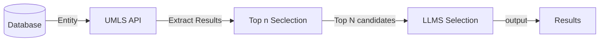

# NEN
## File Structure
 [Dataset](resource/unique_entities_set.json) is a json file, contains the **unique entities** extracted from the RadGraph training dataset, has 1250 unique entities.

[evaluation](evaluation.ipynb) folder contains the evaluation method of the NEN dataset.  
[output](resource/simple/output.csv) show the preliminary results from the simple morphological matching method.  
[output_gpt](resource/gpt/output_gpt.csv) show the preliminary results from the GPT-4 method.  
[humanReview](humanReview/reviewed.xlsx) folder contains the human annotated data as golden data.

Entities are in 3 different cases: normalized, normalized without definition, undefined.

- normalized:  
    LungsC0024109LungsBody Part, Organ, or Organ ComponentLobular organ the parenchyma of which consists of air-filled alveoli which communicate with the tracheobronchial tree. Examples: There are only two instances, right lung and left lung.
- normalized without definition:  
    clear, C2963144, clear, No results, No results
    
- undefined:

| Term              | Code | Description | Examples |
|-------------------|------|-------------|----------|
| cardiomediastinal |      |             |          |

<!-- 
TODO 
entity_nor 代码。
llama的方案
 -->

## Data Processing Pipeline

