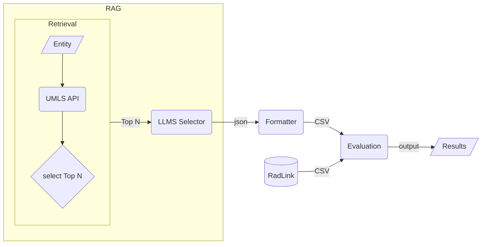

# NEN
## File Structure
 [Dataset](resource/unique_entities_set.json) is a json file, contains the **unique entities** extracted from the RadGraph training dataset, has 1250 unique entities.

[evaluation](evaluation.ipynb) folder contains the evaluation method of the NEN dataset.  
[output](resource/simple/output.csv) show the preliminary results from the simple morphological matching method.  
[output_gpt](resource/gpt/output_gpt.csv) show the preliminary results from the GPT-4 method.  
[humanReview](humanReview/reviewed.xlsx) folder contains the human annotated data as golden data.

Entities are in 3 different cases: normalized, normalized without definition, undefined.

- normalized:  
    LungsC0024109LungsBody Part, Organ, or Organ ComponentLobular organ the parenchyma of which consists of air-filled alveoli which communicate with the tracheobronchial tree. Examples: There are only two instances, right lung and left lung.
- normalized without definition:  
    clear, C2963144, clear, No results, No results
    
- undefined:

| Term              | Code | Description | Examples |
|-------------------|------|-------------|----------|
| cardiomediastinal |      |             |          |

## Technical Implementation

### Transformer Models
We used various Hugging Face Transformer models for entity recognition and processing, including OpenAI GPT-4o, Llama 3, and other models.

### API Integration
- **UMLS REST API**: Used for querying medical terminology and concepts

### Interactive Interface
- **Streamlit Application**: Provides an intuitive user interface for uploading medical reports and visualizing knowledge graphs

### Data Processing Pipeline
- Data cleaning: Removing noise and standardizing formats
- Feature engineering: Extracting features for medical terminology
- Format conversion: Tool functions for JSON/CSV/Excel interconversion

### RAG Architecture
Our retrieval-augmented generation system combines LLM with UMLS:
- Knowledge retrieval module: Obtains relevant concepts from UMLS
- Result ranking and filtering: Based on relevance scores
- Context enhancement: Integrates retrieved knowledge into the entity normalization process

## Dataset Publication
Our annotated dataset has been published on the Hugging Face platform:
- [MedKGC Dataset](https://huggingface.co/datasets/WestAI-SC/RadLink)
- Contains 1,250 manually annotated medical entities mapped to UMLS concepts

## Data Processing Pipeline

